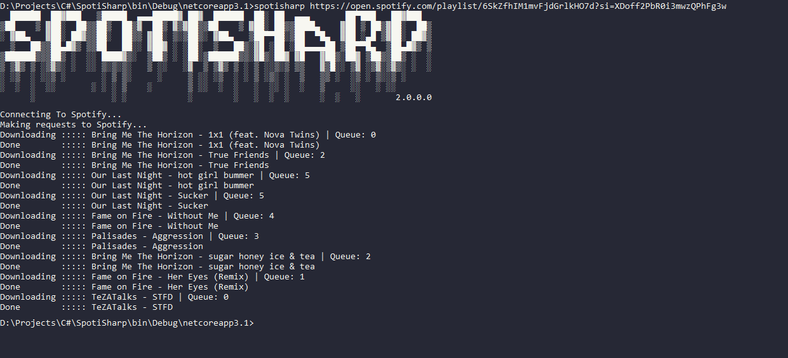
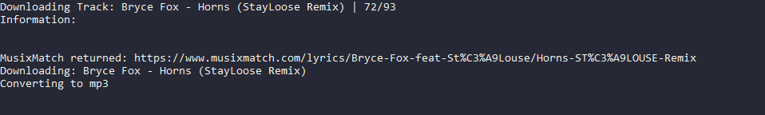
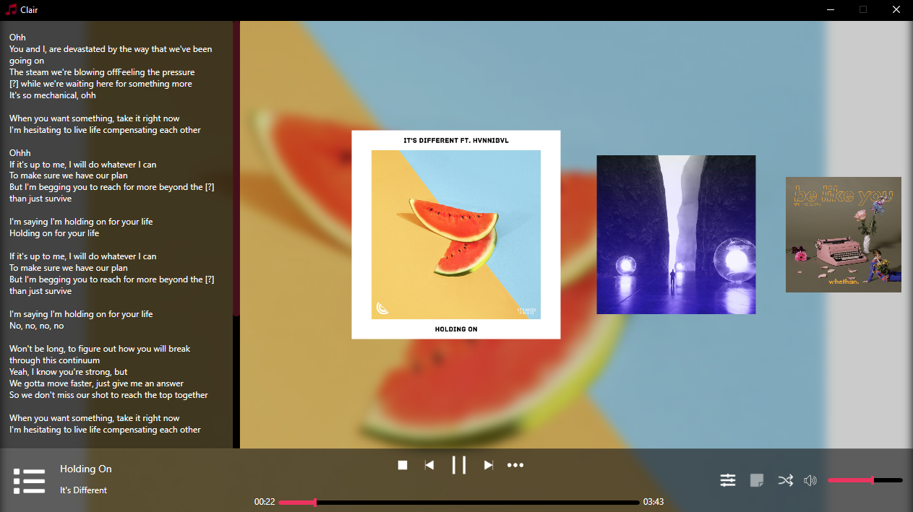

# SpotiSharp


## Music Downloader using Spotify Web API

SpotiSharp is a Open-Source CLI application made in .NET Core

SpotiSharp applies metadata like `Artist` `Title` `Lyrics` `Genres` `Album` `AlbumArt` and more...<br />

Linux users: [README-LINUX](README-LINUX.md)

### Usage

**KEEP THESE KEYS PRIVATE, DO NOT SHARE THEM TO ANYONE**

Create Application on [Spotify Developer Dashboard](https://developer.spotify.com/dashboard/) then provide these keys to config.json

SpotiSharp will generate config.json on first run.</br>
**All non-blank fields will be auto-completed by SpotiSharp**
```json
{
  "Settings": {
    "ConfigVersion": "(SpotiSharp Version)",
    "ClientID": "",
    "ClientSecret": "",
    "FFmpegPath": "(Application Directory)",
    "DownloadPath": "(MyMusic Directory)"
  }
}
```
**You can reset config.json to default settings. Delete desired line and reset ConfigVersion to "0", all missing lines will be replaced with default ones**

SpotiSharp will download FFmpeg to application directory by default.</br>
If FFmpegPath was changed it will overwrite existing FFmpeg and handle autoupdates by itself.

```sh
.\SpotiSharp.exe "<Text Search/Spotify URL>"
```

### Single Track

<br />

### Playlist

<br />

### Result



Screenshot was taken from my [Clair Musicplayer](https://github.com/L0um15/Clair-Musicplayer)

