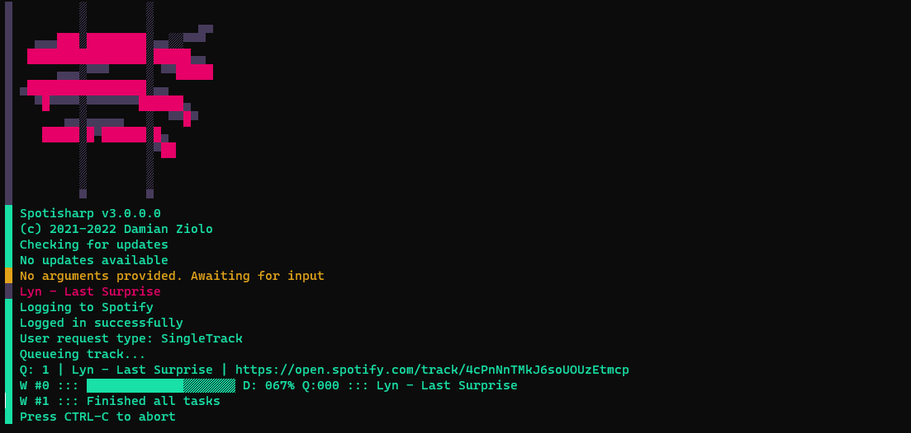
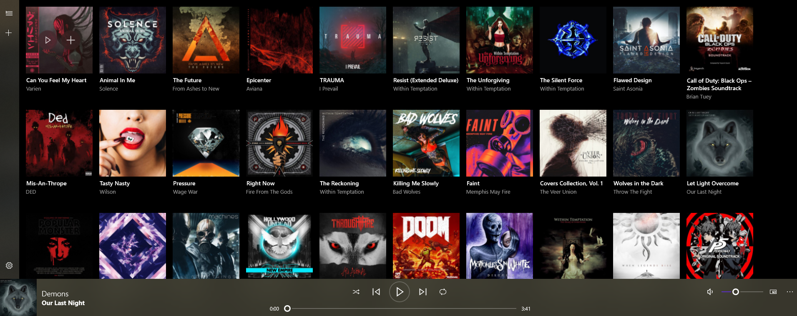

<p align=center>
    
</p>

<h2 align=center>Spotisharp V3</h2>
<p align=center>Cross-platform music assistant</p>

```zsh
 ~/docs > cat ./Spotisharp.md
```

<p align=center>
    
</p>

<p align=center>
    
</p>


### Usage:

There are now two ways to use Spotisharp. Either by double-clicking executable or by passing an argument via the console.

Spotisharp accepts following inputs:
 - Text like: Lyn - Wake Up, Get Up, Get Out There
 - Url's like: https://open.spotify.com/track/4AuZBIN4aeFL9egQldQfRn
 - Uri's like: spotify:track:4AuZBIN4aeFL9egQldQfRn

Sometimes url will look like this: https://open.spotify.com/track/4AuZBIN4aeFL9egQldQfRn?si=3277af7219054b98 and this is fine too.

Spotisharp is able to work with tracks, playlists, and albums.

Passing argument to spotisharp looks like this:
```zsh
~/binaries > echo 'Use quotes when passing argument via console, otherwise everything after whitespaces will be ignored'
~/binaries > ./Spotisharp "Lyn - Wake Up, Get Up, Get Out There"
```
```zsh
~/binaries > ./Spotisharp https://open.spotify.com/track/4AuZBIN4aeFL9egQldQfRn
```
```zsh
~/binaries > ./Spotisharp spotify:track:4AuZBIN4aeFL9egQldQfRn
```
If no argument is provided, spotisharp will await for user input.